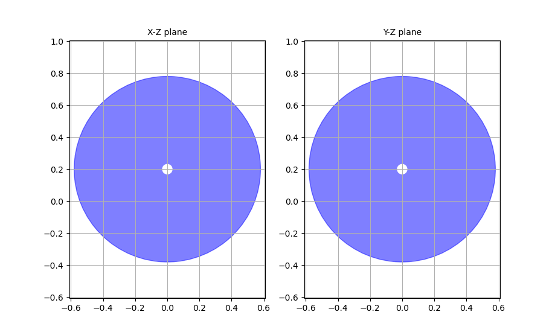

# 3DOF_Robot_Control

## Robot Dimensions


## Robot Workspace
For in this Projects will not considering about Joint Limit or Collisions

so we can determine the workspace by robot extend pose and fold pose


## Installation and Setup

### Step 1: Clone the repository

```bash
git clone https://github.com/ongsa12342/3DOF_Robot_Control.git
```

### Step 2: Build the Package
```bash
cd 3DOF_Robot_Control && colcon build
```
### Step 3: Source the Setup File
```bash
source ~/3DOF_Robot_Control/install/setup.bash
```
### Step 4: (Optional) Add to .bashrc
```bash
echo "source ~/3DOF_Robot_Control/install/setup.bash" >> ~/.bashrc && source ~/.bashrc
```
## Dependencies
`roboticstoolbox-python` v.1.1.1

## Usage
### run launch to open rviz and controller node
```bash
ros2 ros2 launch funny_3dof_robot simple_display.launch.py 
```
### run random position in workspace at /tartget
you can run this after launch file to see random pose and do IPK from this point
```bash
ros2 run funny_3dof_robot random_pose.py
```

### Robot mode
robot mode can call by using service `Mode` at /mode with 3 mode

- 0 (default) : Inverse Pose Kinematics
- 1 : Teleoperation
- 2 : Teleoperation

Example for changing mode by service

```bash
ros2 service call /mode funny_3dof_robot_interfaces/srv/Mode "mode_request: 0"
```

call service 0 to do an IPK