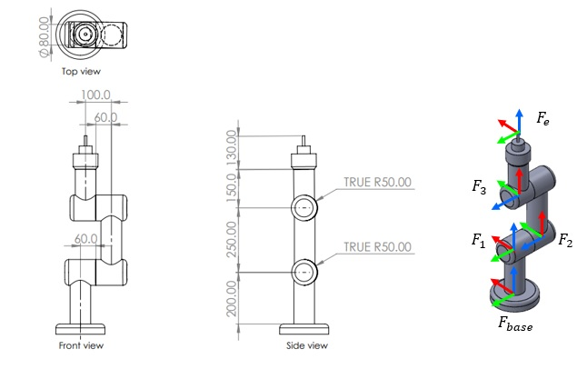

# 3DOF_Robot_Control

## Robot Dimensions



## Robot Workspace
For in this Projects will not considering about Joint Limit or Collisions

so we can determine the workspace by robot extend pose and fold pose


## Installation and Setup

### Step 1: Clone the repository

```bash
git clone https://github.com/ongsa12342/3DOF_Robot_Control.git
```

### Step 2: Build the Package
```bash
cd 3DOF_Robot_Control && colcon build
```
### Step 3: Source the Setup File
```bash
source ~/3DOF_Robot_Control/install/setup.bash
```
### Step 4: (Optional) Add to .bashrc
```bash
echo "source ~/3DOF_Robot_Control/install/setup.bash" >> ~/.bashrc && source ~/.bashrc
```